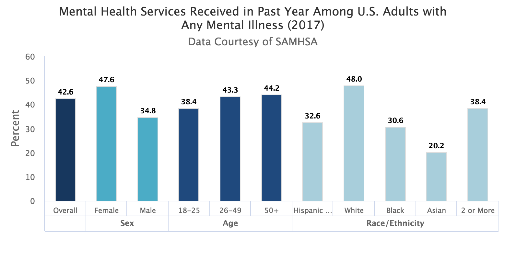

# AccessHealth

## Background of the Issue:
According to National early one in five U.S. adults live with a mental illness (46.6 million in 2017).

## Design Statement:
An app to provide access to mental health services for young professionals (age 18-40) to whom access to mental health care was previously unavailable (due to financial reasons or lack of coverage).

## MVP:
- An app that facilitates the connection between a User (patient) and a Doctor who specializes in mental health services.
- The User logs in and is directed to a landing page which contains information about the app and a FAQ section. From a Nav bar, the User has the ability to access a list of doctors and the User's profile page. Within the Doctor's list page, the User can search for a doctor by name, filter by specialization/location/language/etc, and select a Doctor to view its page.

## App Site Map:
- Landing Page
	- About (app/project)
	- FAQ (with descriptions of )
- Navbar
	- Home
	- Doctor List
	- Profile
- Doctor List Page
	- LIST of doctors
	- SEARCH by name
	- FILTER by specialization/location
	- CLICK on doctor ITEM
- Doctor Show Page
	- DETAILS of doctor
	- MESSAGE doctor through textarea
	- CALENDAR (stretch)
- Profile
	- User details
	- Text area to input mental health issue that needs help

## Technologies Used:
- Blockstack
- React
- Ruby on Rails
